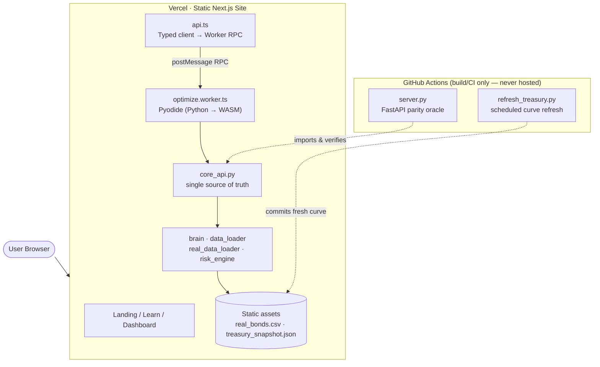

<p align="center">
  <h1 align="center">OptiMarket</h1>
  <p align="center">
    <strong>Quantitative Bond Portfolio Optimization with Real Market Data</strong><br>
    Nelson-Siegel Yield Curve · Covariance Risk Engine · SLSQP Optimization · Monte Carlo VaR · Stress Testing
  </p>
  <p align="center">
    
    
    
    
    
    
    
    
    
  </p>
</p>

---

## Live Demo

- **App:** **[optimarket-psi.vercel.app](https://optimarket-psi.vercel.app)**

> The entire optimizer runs **in your browser**. On first visit the page
> downloads a self-hosted Python runtime (Pyodide + numpy/scipy/pandas,
> ~15 MB, cached after the first load) and shows a real progress bar while
> it boots. There is no server, no cold start, and no data leaves your
> device. If your browser lacks WebAssembly support you get a clear retry
> message instead of a spinner.

---

## Overview

OptiMarket is a bond portfolio optimization platform that constructs
mathematically optimal fixed-income portfolios from **real corporate bond
data** (curated FINRA TRACE snapshot with actual CUSIPs) and a build-time
U.S. Treasury yield curve. It provides Monte Carlo VaR/CVaR, multi-scenario
stress testing, and backtesting against benchmark portfolios.

It runs at **$0/month**: the SciPy optimizer is compiled to WebAssembly via
Pyodide and executes client-side in a Web Worker. The static site is hosted
on Vercel. There is no hosted backend to pay for, rate-limit, or secure.

> **No API keys. No accounts. No network calls at runtime.** Market data
> ships as static assets; the Treasury curve is refreshed at deploy time by
> a scheduled GitHub Action, not at runtime.

### Core Mathematical Components

1. **Nelson-Siegel Yield Curve** — Parametric curve fitted to U.S. Treasury rates (refreshed at deploy time)
2. **Covariance Risk Engine** — N×N correlation matrix capturing sector and credit-tier dependencies
3. **SLSQP Optimizer** — Constrained non-linear programming to maximize the Sharpe Ratio
4. **Monte Carlo Simulator** — 10,000-path VaR/CVaR using Cholesky-decomposed correlated returns
5. **Stress Testing Engine** — 7 macro scenarios (rate shocks, credit crises, 2008 replay)
6. **Backtesting Framework** — Performance vs. equal-weight and risk-free benchmarks

## Features

- **Real Bond Data** — 203 real corporate bonds with actual CUSIPs (Apple, Microsoft, JPMorgan, Boeing, etc.)
- **In-Browser Compute** — The full SciPy optimizer runs client-side via Pyodide (Python → WebAssembly); no server round-trip
- **Deterministic Parity** — The browser imports the exact same `core_api.py` the CI parity oracle does, verified by an end-to-end keystone test (browser result == CPython result within 1e-6)
- **Dual Optimization** — Linear Programming (Maximize Yield) and SLSQP (Maximize Sharpe Ratio)
- **Institutional Constraints** — Duration matching, position limits, junk-bond caps, sector diversification
- **Monte Carlo VaR** — 10,000-simulation P&L distribution with 90/95/99% VaR and CVaR
- **Stress Testing** — 7 scenarios: rate shocks (±100/200bp), credit crisis, flight-to-quality, stagflation, 2008 replay
- **Backtesting** — Optimized vs. equal-weight vs. risk-free benchmark comparison
- **Learning Roadmap** — Interactive 4-phase educational roadmap covering 21 quant finance concepts
- **Premium Dashboard** — Light-theme glassmorphism with Framer Motion animations
- **61 Tests** — Parity oracle, D2 determinism (frozen volatility), keystone golden, plus optimizer/data/risk coverage

## Tech Stack

| Layer | Technology |
|-------|-----------|
| **Compute** | Python compiled to WebAssembly (Pyodide 0.27) · SciPy · NumPy · Pandas — runs in a browser Web Worker |
| **Frontend** | Next.js 16 · TypeScript · Tailwind CSS · Recharts · Framer Motion |
| **Data** | Curated FINRA TRACE corporate bond snapshot · U.S. Treasury curve (deploy-time snapshot) |
| **Optimization** | SciPy `linprog` (LP) · SciPy `minimize` SLSQP (NLP) |
| **Risk Analytics** | Monte Carlo (Cholesky) · Stress Testing · Backtesting |
| **Parity Oracle** | FastAPI wrapper over `core_api.py` — CI/testing only, never hosted |
| **Testing** | pytest (61 tests) · Playwright (browser-vs-oracle keystone parity) |
| **Hosting** | Vercel (static site + self-hosted Pyodide). Cost: $0/month. |

## Architecture



**One-paragraph tour.** The browser loads a static Next.js site. Each
analytics tab calls the typed `api.ts` client, which is now an RPC layer over
a Web Worker. The worker boots a self-hosted Pyodide runtime, loads
numpy/scipy/pandas, and imports `core_api.py` — the single source of truth.
`core_api` delegates to `brain.py` (LP/SLSQP optimization), `data_loader.py`
(Nelson-Siegel + synthetic universe), `real_data_loader.py` (the FINRA TRACE
CSV), and `risk_engine.py` (Monte Carlo / stress / backtest). `server.py` is a
thin FastAPI wrapper over the *same* `core_api` used **only** as the CI parity
oracle — it is never deployed, so the browser and the answer-key run identical
code by construction. A scheduled GitHub Action refreshes the Treasury
snapshot at deploy time so the curve is current at $0 runtime cost.

## Mathematical Pipeline

> **For the deeper write-up** — derivations, intuition, and references for
> every component — see [**MATH.md**](MATH.md).

### 1. Nelson-Siegel Yield Curve

```math
y(\tau) = \beta_0 + \beta_1 \cdot \frac{1 - e^{-\lambda \tau}}{\lambda \tau} + \beta_2 \cdot \left[ \frac{1 - e^{-\lambda \tau}}{\lambda \tau} - e^{-\lambda \tau} \right]
```

Fits a continuous yield function to sparse Treasury data using `scipy.optimize.curve_fit`.

### 2. Portfolio Risk Model

```math
\sigma_p^{2} = w^{\top} \Sigma\, w
```

Covariance matrix $\Sigma$ captures cross-correlations: high within same sector/rating, low across sectors.

### 3. Sharpe Ratio Optimization

```math
\max_{w} \quad \frac{w^{\top} \mu - R_f}{\sqrt{w^{\top} \Sigma\, w}}
```

```math
\begin{aligned}
\text{subject to} \quad
& \sum_i w_i = 1 && \text{(fully invested)} \\
& w^{\top} D = D_{\text{target}} && \text{(duration match)} \\
& 0 \le w_i \le w_{\max} && \text{(no shorting, position cap)} \\
& \sum_{i \in \text{junk}} w_i \le \text{junk}_{\max} && \text{(HY exposure cap)} \\
& \sum_{i \in \text{sector}_k} w_i \le \text{sec}_{\max} && \forall\, k
\end{aligned}
```

### 4. Monte Carlo VaR / CVaR

```math
\Sigma = L\, L^{\top}, \qquad Z \sim \mathcal{N}(0, I), \qquad R = Z\, L^{\top}
```

```math
r_{\text{path}} = \left( \mu_p - \tfrac{1}{2}\sigma_p^{2} \right) \cdot dt + (R \cdot w)\sqrt{dt}, \qquad V = V_0 \cdot e^{r_{\text{path}}}
```

```math
\text{VaR}_{\alpha} = -\,\mathrm{quantile}\bigl(\mathrm{PnL},\, 1-\alpha\bigr), \qquad \text{CVaR}_{\alpha} = -\,\mathbb{E}\bigl[\mathrm{PnL} \mid \mathrm{PnL} \le -\text{VaR}_{\alpha}\bigr]
```

### 5. Stress Testing

Per-bond modified-duration approximation aggregated across the portfolio:

```math
\frac{\Delta P_{\text{port}}}{P_{\text{port}}} = \sum_i w_i \cdot \bigl(-D_i \cdot \Delta y_i\bigr)
```

Applied under 7 macro scenarios (rate shocks, credit crisis, flight-to-quality,
stagflation, 2008 replay) with credit spread multipliers that hit IG and HY
bonds asymmetrically.

> **Math audit note.** The codebase was line-audited against textbook
> formulas; see [MATH.md §9](MATH.md#9-math-audit-log) for the issues that
> were found and corrected (backtest volatility scaling, stress-test
> aggregation, risk-free rate consistency).

## Getting Started

### Prerequisites

- Node.js 20+ (to run the site)
- Python 3.11+ (only to run the test suite / parity oracle — not needed to use the app)

### Run the app locally

```bash
git clone https://github.com/sparsh-j01/opti-market.git
cd opti-market/frontend

npm install
npm run dev     # vendors Pyodide on first run, then serves on :3000
```

Open **http://localhost:3000**. The optimizer runs entirely in your browser —
no backend process to start.

> `npm run dev` / `npm run build` automatically vendor a pinned, integrity-
> verified Pyodide release into `frontend/public/pyodide/` (gitignored,
> regenerated at build time).

### Run the test suite (parity oracle)

```bash
pip install -r requirements.txt
python -m pytest tests/ -v
```

61 tests cover the optimizer (including closed-form correctness checks),
data loaders, the risk engine, D2 determinism (the frozen `Volatility`
column must equal its original computed values exactly), and a golden that
keeps the browser-vs-oracle Playwright keystone honest.

```bash
# End-to-end browser-vs-oracle parity (downloads Chromium, boots Pyodide)
cd frontend && npm run test:e2e
```

## Compute API

`core_api.py` exposes one function per analytics capability. Both the browser
worker and the FastAPI parity oracle call these identically:

| Function | Description |
|----------|-------------|
| `yield_curve()` | Nelson-Siegel fitted yield curve + parameters |
| `bonds(source)` | 203 real or synthetic bond market data |
| `optimize(params)` | Constrained optimization → portfolio + metrics |
| `efficient_frontier(params)` | Efficient frontier data points |
| `monte_carlo(params)` | Monte Carlo VaR/CVaR (10K paths) |
| `stress_test(params)` | 7 stress scenarios on the portfolio |
| `backtest(params)` | Historical backtest vs. benchmarks |
| `stress_scenarios()` | List available stress scenarios |

The CI-only `server.py` mirrors these as REST endpoints (`/api/optimize`, …)
for the oracle test; it is never hosted.

## Project Structure

```
opti-market/
├── core_api.py            # Single source of truth (browser + oracle import this)
├── server.py              # FastAPI parity oracle — CI/testing only, never hosted
├── brain.py               # Optimization engine (linprog + SLSQP)
├── data_loader.py         # Nelson-Siegel + static Treasury snapshot + synthetic universe
├── real_data_loader.py    # FINRA TRACE CSV loader (frozen, RNG-free)
├── risk_engine.py         # Monte Carlo, stress testing, backtesting
├── requirements.txt       # Python deps (oracle/tests + build-time only)
├── MATH.md                # Mathematical foundations & references
├── data/
│   ├── real_bonds.csv     # 203 real corporate bonds (CUSIPs + frozen Volatility)
│   └── treasury_snapshot.json  # Deploy-time Treasury curve
├── scripts/
│   ├── bake_real_bonds.py        # Freezes the Volatility column (idempotent)
│   ├── refresh_treasury.py       # Build-time Treasury refresh (GitHub Action)
│   ├── sync_frontend_assets.py   # Stages py + data into frontend/public/
│   ├── gen_parity_golden.py      # Regenerates the Playwright keystone golden
│   └── check_no_attribution.sh   # CI hygiene guard
├── tests/                 # 61 pytest tests (incl. parity, D2, golden)
├── .github/workflows/
│   ├── test.yml           # hygiene · pytest oracle · Next.js build
│   └── refresh-data.yml   # Scheduled Treasury refresh → commit → redeploy
└── frontend/
    ├── scripts/vendor-pyodide.mjs   # Self-hosts a pinned, hash-verified Pyodide
    ├── src/
    │   ├── app/                     # Landing · Learn · Dashboard
    │   ├── components/
    │   │   └── EngineBootOverlay.tsx  # Boot progress + failure/retry UI
    │   ├── workers/optimize.worker.ts # Pyodide worker
    │   └── lib/api.ts                 # Typed worker-RPC client
    ├── e2e/                         # Playwright keystone parity + flow specs
    ├── package.json
    └── tsconfig.json
```

## References

1. Markowitz, H. (1952). Portfolio Selection. *The Journal of Finance*, 7(1), 77–91.
2. Nelson, C. R., & Siegel, A. F. (1987). Parsimonious Modeling of Yield Curves. *The Journal of Business*, 60(4), 473–489.
3. Sharpe, W. F. (1966). Mutual Fund Performance. *The Journal of Business*, 39(1), 119–138.
4. Kraft, D. (1988). A software package for sequential quadratic programming. *DFVLR-FB 88-28*.
5. Jorion, P. (2006). *Value at Risk: The New Benchmark for Managing Financial Risk*. McGraw-Hill.
6. Fabozzi, F. J. (2007). *Fixed Income Analysis*. 2nd ed. CFA Institute Investment Series, Wiley.
7. Glasserman, P. (2003). *Monte Carlo Methods in Financial Engineering*. Springer.
8. Rockafellar, R. T., & Uryasev, S. (2000). Optimization of Conditional Value-at-Risk. *Journal of Risk*, 2(3), 21–41.
9. Diebold, F. X., & Li, C. (2006). Forecasting the term structure of government bond yields. *Journal of Econometrics*, 130(2), 337–364.
10. Merton, R. C. (1972). An Analytic Derivation of the Efficient Portfolio Frontier. *Journal of Financial and Quantitative Analysis*, 7(4), 1851–1872.
11. Alexander, C. (2008). *Market Risk Analysis Volume IV: Value at Risk Models*. John Wiley & Sons.
12. Hull, J. C. (2018). *Options, Futures, and Other Derivatives*. 10th ed. Pearson.

## License

This project is licensed under the MIT License.
