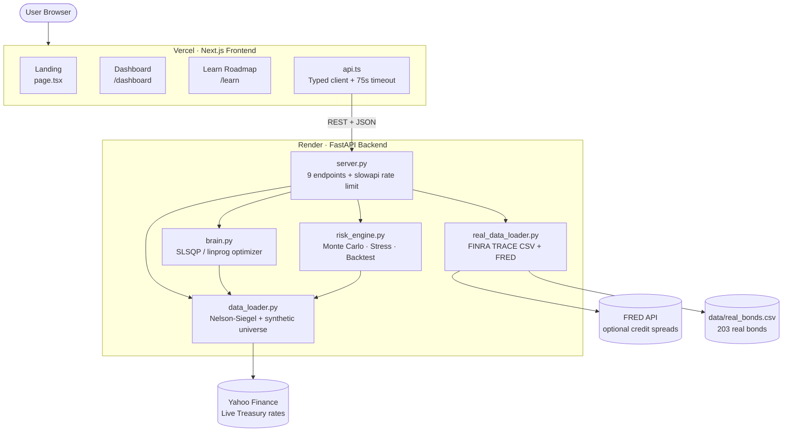

<p align="center">
  <h1 align="center">OptiMarket</h1>
  <p align="center">
    <strong>Quantitative Bond Portfolio Optimization with Real Market Data</strong><br>
    Nelson-Siegel Yield Curve · Covariance Risk Engine · SLSQP Optimization · Monte Carlo VaR · Stress Testing
  </p>
  <p align="center">
    
    
    
    
    
    
    
    
    
  </p>
</p>

---

## Live Demo

- **Frontend:** _coming soon_ — Vercel deploy URL will go here
- **Backend API:** _coming soon_ — Render deploy URL will go here
- **Health check:** `/api/health`

> The backend runs on Render's free tier and **cold-starts in 30-60s**
> after idle. The frontend handles this with a 75s fetch timeout and a
> friendly retry message.

---

## Overview

OptiMarket is a full-stack bond portfolio optimization platform that constructs mathematically optimal fixed-income portfolios using **real corporate bond data** from FINRA TRACE and live Treasury yields. It provides institutional-grade risk analytics including Monte Carlo VaR/CVaR, multi-scenario stress testing, and backtesting against benchmark portfolios.

> **No API keys required.** The system works out of the box with bundled market data and fallback rates. FRED API key is optional for live enrichment.

### Core Mathematical Components

1. **Nelson-Siegel Yield Curve** — Fits a parametric curve to live U.S. Treasury rates (Yahoo Finance / FRED API)
2. **Covariance Risk Engine** — Builds an N×N correlation matrix capturing sector and credit-tier dependencies
3. **SLSQP Optimizer** — Solves constrained non-linear programming to maximize the Sharpe Ratio
4. **Monte Carlo Simulator** — 10,000-path VaR/CVaR estimation using Cholesky-decomposed correlated returns
5. **Stress Testing Engine** — 7 pre-defined macro scenarios (rate shocks, credit crises, 2008 replay)
6. **Backtesting Framework** — Historical performance comparison vs. equal-weight and risk-free benchmarks

## Features

- **Real Bond Data** — 200+ real corporate bonds with actual CUSIPs from FINRA TRACE (Apple, Microsoft, JPMorgan, etc.)
- **Live Yield Curve** — Real-time Treasury data fitted with Nelson-Siegel (β₀, β₁, β₂, λ)
- **Dual Optimization** — Linear Programming (Maximize Yield) and SLSQP (Maximize Sharpe Ratio)
- **Institutional Constraints** — Duration matching, position limits, junk bond caps, sector diversification
- **Monte Carlo VaR** — 10,000-simulation P&L distribution with 90/95/99% VaR and CVaR
- **Stress Testing** — 7 scenarios: Rate shocks (±100/200bp), credit crisis, flight-to-quality, stagflation, 2008 replay
- **Backtesting** — Optimized vs. equal-weight vs. risk-free benchmark comparison
- **Learning Roadmap** — Interactive 4-phase educational roadmap covering 21 quant finance concepts with sticky navigation and detail modals
- **Premium Dashboard** — Light-theme glassmorphism with Framer Motion animations
- **47 Unit Tests** — Full test coverage including 4 closed-form correctness tests for the optimizer
- **Production Hardening** — Per-IP rate limiting (slowapi), env-driven CORS, fetch timeouts for free-tier cold starts

## Tech Stack

| Layer | Technology |
|-------|-----------|
| **Backend** | Python · FastAPI · SciPy · NumPy · Pandas |
| **Frontend** | Next.js 16 · TypeScript · Tailwind CSS · Recharts · Framer Motion |
| **Data** | FINRA TRACE (real bonds) · Yahoo Finance / FRED API (live Treasury yields) |
| **Optimization** | SciPy `linprog` (LP) · SciPy `minimize` SLSQP (NLP) |
| **Risk Analytics** | Monte Carlo (Cholesky) · Stress Testing · Backtesting |
| **Testing** | pytest (47 tests, 4 closed-form correctness checks) |
| **Hosting** | Vercel (frontend) · Render (FastAPI backend) |

## Architecture



**One-paragraph tour.** The browser hits the Next.js frontend on Vercel. Each
analytics tab calls the typed `api.ts` client, which forwards the request to
the FastAPI backend on Render. `server.py` is the only entry point — it
delegates: yield-curve fitting and synthetic-universe generation to
`data_loader.py`, real bond loading to `real_data_loader.py`, constrained
optimization (LP and SLSQP) to `brain.py`, and Monte Carlo / stress / backtest
to `risk_engine.py`. Yahoo Finance feeds live Treasury yields; the bundled
CSV provides 203 real corporate bonds with actual CUSIPs.

## Mathematical Pipeline

> **For the deeper write-up** — derivations, intuition, and references for
> every component — see [**MATH.md**](MATH.md).

### 1. Nelson-Siegel Yield Curve

```math
y(\tau) = \beta_0 + \beta_1 \cdot \frac{1 - e^{-\lambda \tau}}{\lambda \tau} + \beta_2 \cdot \left[ \frac{1 - e^{-\lambda \tau}}{\lambda \tau} - e^{-\lambda \tau} \right]
```

Fits a continuous yield function to sparse Treasury data using `scipy.optimize.curve_fit`.

### 2. Portfolio Risk Model

```math
\sigma_p^{2} = w^{\top} \Sigma\, w
```

Covariance matrix $\Sigma$ captures cross-correlations: high within same sector/rating, low across sectors.

### 3. Sharpe Ratio Optimization

```math
\max_{w} \quad \frac{w^{\top} \mu - R_f}{\sqrt{w^{\top} \Sigma\, w}}
```

```math
\begin{aligned}
\text{subject to} \quad
& \sum_i w_i = 1 && \text{(fully invested)} \\
& w^{\top} D = D_{\text{target}} && \text{(duration match)} \\
& 0 \le w_i \le w_{\max} && \text{(no shorting, position cap)} \\
& \sum_{i \in \text{junk}} w_i \le \text{junk}_{\max} && \text{(HY exposure cap)} \\
& \sum_{i \in \text{sector}_k} w_i \le \text{sec}_{\max} && \forall\, k
\end{aligned}
```

### 4. Monte Carlo VaR / CVaR

```math
\Sigma = L\, L^{\top}, \qquad Z \sim \mathcal{N}(0, I), \qquad R = Z\, L^{\top}
```

```math
r_{\text{path}} = \left( \mu_p - \tfrac{1}{2}\sigma_p^{2} \right) \cdot dt + (R \cdot w)\sqrt{dt}, \qquad V = V_0 \cdot e^{r_{\text{path}}}
```

```math
\text{VaR}_{\alpha} = -\,\mathrm{quantile}\bigl(\mathrm{PnL},\, 1-\alpha\bigr), \qquad \text{CVaR}_{\alpha} = -\,\mathbb{E}\bigl[\mathrm{PnL} \mid \mathrm{PnL} \le -\text{VaR}_{\alpha}\bigr]
```

### 5. Stress Testing

Per-bond modified-duration approximation aggregated across the portfolio:

```math
\frac{\Delta P_{\text{port}}}{P_{\text{port}}} = \sum_i w_i \cdot \bigl(-D_i \cdot \Delta y_i\bigr)
```

Applied under 7 macro scenarios (rate shocks, credit crisis, flight-to-quality,
stagflation, 2008 replay) with credit spread multipliers that hit IG and HY
bonds asymmetrically.

> **Math audit note.** The codebase was line-audited against textbook
> formulas; see [MATH.md §9](MATH.md#9-math-audit-log) for the issues that
> were found and corrected (backtest volatility scaling, stress-test
> aggregation, risk-free rate consistency).

## Getting Started

### Prerequisites

- Python 3.9+
- Node.js 18+

### Installation

```bash
git clone https://github.com/sparsh-j01/opti-market.git
cd opti-market

# Install Python dependencies
pip install -r requirements.txt

# Install frontend dependencies
cd frontend
npm install
cd ..
```

### Local environment files (optional)

For local development the defaults work without any env config. If you want
to override the backend URL or CORS origins:

```bash
# Frontend
cp frontend/.env.local.example frontend/.env.local

# Backend
cp .env.example .env
```

### Running the Application

```bash
# Terminal 1: Start the backend (port 8000)
uvicorn server:app --port 8000 --reload

# Terminal 2: Start the frontend (port 3000)
# IMPORTANT: Run from the frontend/ directory, NOT the project root
cd frontend
npm run dev
```

Then open **http://localhost:3000** in your browser.

> **No API keys required by default.** Yahoo Finance is used for Treasury
> rates with sensible fallbacks. FRED API key is optional for credit-spread
> enrichment.

### Running Tests

```bash
python -m pytest tests/ -v
```

47 tests cover the optimizer (including 4 closed-form correctness tests
that verify the LP/SLSQP wiring against known answers), data loaders, and
risk engine.

## Deployment

The repo is split for the standard "frontend on Vercel, FastAPI on Render"
pattern.

### Backend → Render
1. New + → Web Service → connect this repo
2. Root Directory: *(blank)* | Runtime: Python 3 | Build: `pip install -r requirements.txt`
3. Start Command: `uvicorn server:app --host 0.0.0.0 --port $PORT`
4. Add env var `ALLOWED_ORIGINS` once the frontend is deployed (see Step 3 below)

`runtime.txt` pins Python 3.11.9. `/api/health` is exempt from rate
limits so Render's health probes don't burn quota.

### Frontend → Vercel
1. Add New → Project → import this repo
2. **Root Directory: `frontend`** (critical — Vercel must build from the subdir)
3. Env var: `NEXT_PUBLIC_API_BASE_URL` = your Render URL (no trailing slash)

### Wire CORS
Once the Vercel URL is live, set `ALLOWED_ORIGINS` on Render to that URL
(comma-separated if you have multiple domains). Render auto-redeploys.

### Rate limits
Per-IP, free tier protection:
- `/api/yield-curve` — 30/min
- `/api/bonds`, `/api/stress-scenarios` — 60/min
- `/api/optimize`, `/api/stress-test` — 20/min
- `/api/efficient-frontier`, `/api/monte-carlo`, `/api/backtest` — 10/min

## API Endpoints

| Endpoint | Method | Description |
|----------|--------|-------------|
| `/api/yield-curve` | GET | Nelson-Siegel fitted yield curve + parameters |
| `/api/bonds?source=real` | GET | 200+ real or 150 synthetic bond market data |
| `/api/optimize` | POST | Run constrained optimization, returns portfolio + metrics |
| `/api/efficient-frontier` | POST | Generate efficient frontier data points |
| `/api/monte-carlo` | POST | Monte Carlo VaR/CVaR simulation (10K paths) |
| `/api/stress-test` | POST | Run 7 stress scenarios on portfolio |
| `/api/backtest` | POST | Historical backtest vs. benchmarks |
| `/api/stress-scenarios` | GET | List available stress test scenarios |
| `/api/health` | GET | Health check |

## Project Structure

```
opti-market/
├── server.py              # FastAPI backend (9 endpoints, slowapi rate limit)
├── brain.py               # Optimization engine (linprog + SLSQP)
├── data_loader.py         # Nelson-Siegel fitting + synthetic universe
├── real_data_loader.py    # FINRA TRACE + FRED API data loader
├── risk_engine.py         # Monte Carlo, stress testing, backtesting
├── requirements.txt       # Python dependencies
├── runtime.txt            # Python version pin (Render)
├── .env.example           # Backend env template (ALLOWED_ORIGINS)
├── MATH.md                # Mathematical foundations & references
├── data/
│   └── real_bonds.csv     # 203 real corporate bonds (CUSIPs)
├── tests/
│   ├── test_brain.py      # 20 optimizer tests (4 closed-form correctness)
│   ├── test_data_loader.py # 15 data loading tests
│   └── test_risk_engine.py # 12 risk analytics tests
└── frontend/
    ├── src/
    │   ├── app/
    │   │   ├── page.tsx           # Landing page
    │   │   ├── learn/
    │   │   │   └── page.tsx       # Learning Roadmap (4 phases, 21 concepts)
    │   │   ├── dashboard/
    │   │   │   └── page.tsx       # Dashboard (6 tabs)
    │   │   ├── globals.css        # Design system
    │   │   └── layout.tsx         # Root layout + SEO
    │   ├── components/
    │   │   ├── Navbar.tsx         # Navigation bar
    │   │   └── AnalyticsPanels.tsx # MC, Stress, Backtest panels
    │   └── lib/
    │       └── api.ts             # Typed API client
    ├── .env.local.example  # Frontend env template (NEXT_PUBLIC_API_BASE_URL)
    ├── package.json
    └── tsconfig.json
```

## References

1. Markowitz, H. (1952). Portfolio Selection. *The Journal of Finance*, 7(1), 77–91.
2. Nelson, C. R., & Siegel, A. F. (1987). Parsimonious Modeling of Yield Curves. *The Journal of Business*, 60(4), 473–489.
3. Sharpe, W. F. (1966). Mutual Fund Performance. *The Journal of Business*, 39(1), 119–138.
4. Kraft, D. (1988). A software package for sequential quadratic programming. *DFVLR-FB 88-28*.
5. Jorion, P. (2006). *Value at Risk: The New Benchmark for Managing Financial Risk*. McGraw-Hill.
6. Fabozzi, F. J. (2007). *Fixed Income Analysis*. 2nd ed. CFA Institute Investment Series, Wiley.
7. Glasserman, P. (2003). *Monte Carlo Methods in Financial Engineering*. Springer.
8. Rockafellar, R. T., & Uryasev, S. (2000). Optimization of Conditional Value-at-Risk. *Journal of Risk*, 2(3), 21–41.
9. Diebold, F. X., & Li, C. (2006). Forecasting the term structure of government bond yields. *Journal of Econometrics*, 130(2), 337–364.
10. Merton, R. C. (1972). An Analytic Derivation of the Efficient Portfolio Frontier. *Journal of Financial and Quantitative Analysis*, 7(4), 1851–1872.
11. Alexander, C. (2008). *Market Risk Analysis Volume IV: Value at Risk Models*. John Wiley & Sons.
12. Hull, J. C. (2018). *Options, Futures, and Other Derivatives*. 10th ed. Pearson.

## License

This project is licensed under the MIT License.
